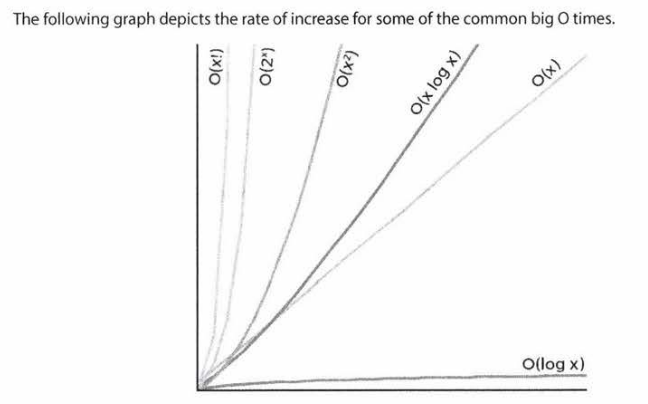
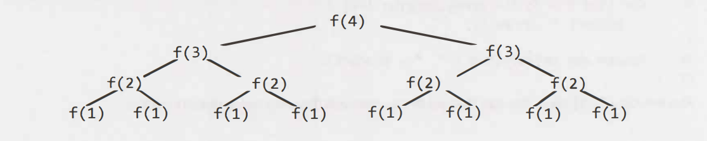

# Big O

Big O time is the language and metric we use to describe the efficiency of algorithms.
Every developer should master this concept.

### Time complexity

This is what the concept of asymptotic runtime, or Big O time, means.

There are many runtimes, for instance:

O(1)

O(N)

O(N2)

O(log N)

O(N log N)

O(2n)

You can have multiple variables in your runtime. For example, the time to paint a fence that's W meters wide and H meters high could be described by O(WH). If you need P layers of paint, then you could say that time is O(WHP).

### Space complexity

Time is not the only things that matters in an algorithm. We might also care about the amount of memory ––or space––required by an algorithm.

Space complexity is a parallel concept to time complexity.
For instance, if we need to create an array of size N, this will require O(N) space. If we need a two-dimensional NxN, this will require O(N2) space.

**Drop the Constants**

Big O just describes the rate of increase. For this reason, we drop the constants in realtime. An algorithm that one might have described as O(2N) is actually O(N).

**Drop the Non-Dominant Terms**

You should drop the non-dominant terms.

O(N2 + N) ––> O(N2)

O(N + log N) ––> O(N)

O(5*2n + 1000N100) ––> O(2n)

Following graph depicts the rate of increase for some of the common Big O times.

As we can see, O(x2) is much worse than O(x), but it's not nearly as bad as O(2x) or O(x!),
There are lots of runtimes worse than O(x!) too, such as O(xx) or O(2x * x!)

**Multi-Part algorithms: Add vs. Multiply**

Suppose you have an algorithm that has 2 steps. When do you multiply the runtimes and when do you add them?

Add the runtimes: O(A + B)

    for (int a: arrayA) {
      print(a);
    }

    for (int b: arrayB) {
      print(b);
    }

Multiply the runtimes: O(A*B)

    for (int a: arrayA) {
      for (int b: arrayB) {
        print(a + "," + b);
      }
    }

In other words:

If your algorithm is in the form *"do this, then, when you're all done, do that"*, then you add the runtimes.

If your algorithm is in the form: *"do this for each time you do that"*, then you multiply the runtimes.

**Log N Runtimes**

*pending...*

**Recursive Runtimes**

    inf f(int ) {
      if (n <= 1) {
        return 1;
      }
      return f(n - 1) + f(n - 1)
    }

Let's derive the runtime by walking through the code. Suppose we call f(4). This calls f(3) twice. Each of those calls to f(3) calls f(2), until we get down to f(1).

Try to remember this pattern. When you have a **recursive function** that makes multiple calls, the runtime will often (but not always) look like O(branchesdepth), where branches is the number of of times each recursive call branches. In this case, this gives us O(2n).

The *space* complexity of this algorithm will be O(N). Although we have O(2n) nodes in the tree total, only O(N) exist at any given time. Therefore, we would only need to have O(N) memory available.

***Problems***

1- The following code computes the product of a and b. What is its runtime?

    int product(int a, int b) {
      int sum=0;
      for(int i=0; i < b; i++) {
        sum += a;
      }
      return sum;
    }

2- The following code computes ab. What is its runtime?

    int power(int a, int b){
      if (b < 0) {
        return 0; // error
      } else if (b==0) {
        return 1
      } else {
        return a * power(a, b - 1)
      }
    }

3- The following code computes a % b. What is its runtime?

    int mod(int a, int b) {
      if (b <= 0) {
        return -1;
      }
      int div = a / b;
      return a - div * b;
    }

4- The following code performs integer division. What is the runtime (assume a and b are both positives)?

    int div(int a, int b){
      int count = 0;
      int sum = b;
      while(sum <= a) {
        sum += b;
        count++;
      }
      return count;
    }

5- The following code computes the [integer] square root of a number. If the number is not a perfect square (there is no integer square root), then it returns -1. It does this by succesive guessing. If n is 100, it first guesses 50. Too high? Try something lower – halfway between 1 and 50. What is its runtime?

    int sqrt(int n) {
      return sqrt_helper(1, n, 1);
    }

    int sqrt_helper(int n, int min, int max) {
      if (max < min) {
        return -1;
      }

      int guess = (min + max) / 2;
      if (guess * guess === n) {
        return guess;
      } else if (guess * guess < n) { // too low
        return sqrt_helper(n, guess + 1, max); // try higher
      } else { // too high
        return sqrt_helper(n, min, guess -1); // try lower
      }
    }

6- The following code computes the [integer] square root of a number. If the number is not a perfect square (there is no integer square root), then it returns -1. It does this by trying to increasingly large numbers until it finds the right value (or is too high). What is its runtime?

    int sqrt(int n) {
      for (int guess = 1; guess * guess <= n; guess++) {
        if (guess * guess === n ) {
          return guess;
        }
      }
      return -1;
    }

7- If a binary search tree is not balanced, how long might it take (worst case) to find an element in it?

8- You are looking for a specific value in a binary tree, but the tree is not a binary search tree. What is the time complexity of this?

9- The *appendToNew* method appends a value to an array by creating a new, longer array and returning this longer array. You've used the *appendToNew* method to create a *copyArray* function that repeatedly calls *appendToNew*. How long does copying an array take?

    int[] copyArray(int[] array) {
      int[] copy = new int[0]
      for (int value: array) {
        copy = appentToNew(copy, value);
      } 
      return copy;
    }

    int[] appendToNew(int[] array, int value) {
      // copy all elements over the new array
      int[] bigger = new int[array.length + 1];
      for (int = 0; i < array.length; i++) {
        bigger[i] = array[i];
      }

      // add new element
      bigger[bigger.length -1] = value;
      return bigger;
    }

10- Code sums the digits in a number. What is its big O time?

    int sumDigits(int n) {
      int sum = 0;
      int n = 100;
      while (n > 0) {
        sum += n % 10;
        n /= 10;
      }

      return sum;
    }

11- The following code prints all strings of length K where the characters are in sorted order. It does this by generating all strings of length K and then checking if each is sorted. What is its runtime?

    int numChars = 26;

    void printSortedStrings(int remaining) {
      printSortedStrings(remaining, "");
    }

    void printSortedStrings(int remaining, String prefix) {
      if (remaining === 0) {
        if (isInOrder(prefix)) {
          System.out.println(prefix);
        }
      } else {
        for (int i = 0; i < numChars; i++) {
          char c = ithLetter(i);
          printSortedStrings(remaining -1, prefix + c);
        }
      }
    }

    boolean isInOrder(String s) {
      for(int = 1; i < s.length(); i++) {
        int prev = ithLetter(s.charAt(i - 1));
        int curr = ithLetter(s.charAt(i));
        if (prev >  curr) {
          return false;
        }
      }
      return true;
    }

    char ithLetter(int i){
      return (char) ( ( (int) 'a') + i);
    }

12- The following code computes the intersection (the number of elements in common) of two arrays. It assumes that neither array has duplicates.It computes the intersection by sorting one array (array b) and then iterating through array *a* checking (via binary search) if each value is in *b*. What is its runtime?

    int intersection(int[] a, int[] b) {
      mergeSort(b);

      int intersect = 0;

      for (int x: a) {
        if (binarySearch(b, x) >= 0) {
          intersect++;
        }
      }

      return intersect;
    }