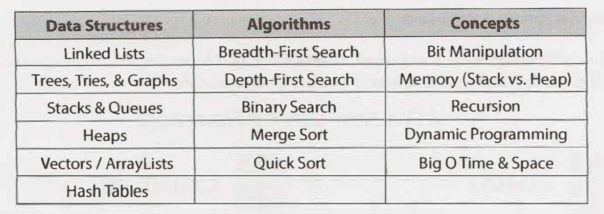
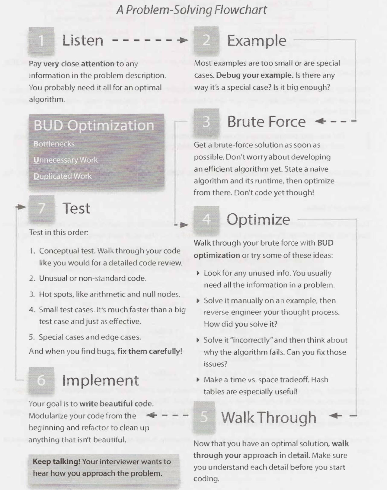

# Technical Questions

Extracted from Cracking the Coding Interview.

### How to prepare

1. Try tosolve the problem on your own. When you are solving a problem, make sure to think about the space and time efficiency.
2. Write the code on paper.
3. Test your code––on paper. This means testing the general cases, base cases, error cases, and so on.
4. Type your paper code as-is into a computer. Start a list of all the errors you make so that you can keep these in mind during the actual interview.

### What you need to know

**Core Data Structures, Algorithms and Concepts.**

Here's a list of the absolute, must-have knowledge:

For each of these topics, make sure you understand how to use and implement them and, when applicable, the space and time complexity.

In particular, hash tables are an extremely important topic.

> Practicing implementing the data structures and algorithm (on paper, and then on a computer) is also a great exercise. It will help you learn how the internals of the data structures work, which is important for many interviews.

**Powers of 2 table**

The table below is useful for many questions involving scalability or any sort of memory limitation. You should be comfortable deriving it.

### Walking Through a Problem

The below map/flowchart walks you through how to solve a problem. Use this in your practice. 

