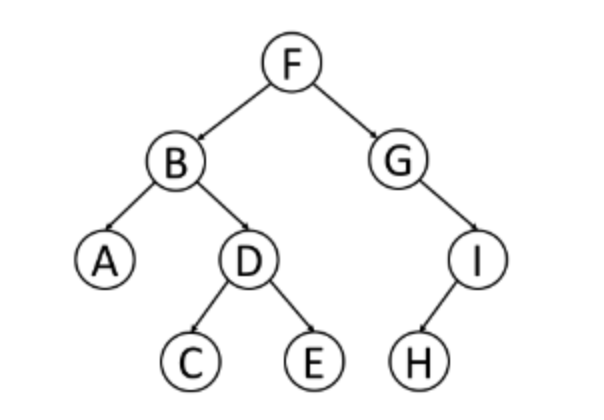

# Trees

A tree is a frequently-used data structure to simulate a hierarchical tree structure.

Each node of the tree will have a root value and a list of references to other nodes which are called child nodes. From graph view, a tree can also be defined as a directed acyclic graph which has N nodes and N-1 edges.

A Binary Tree is one of the most typical tree structure. As a name suggests, a Binary Tree is a tree data structure in which each node has at most two children, which are referred to as the left child and right child.

## Traversal methods

Understanding the different traversal methods used in a Binary Tree will definitely helps to have a better understanding of the tree structure and have a solid foundation for the further study.

### Pre-order traversal

Pre-order traversal is to visit the root first. Then traverse the left subtree. Finally, traverse the rigth subtree.

For instance, a preorder traversal for the above binary tree image would be:

**F, B, A, D, C, E, G, I, H**

### In-order traversal

In-order traversal is to traverse the left subtree first. Then visit the root and finally, traverse the rigth subtree.

In-order traversal for above binary tree would be:

**A, B, C, D, E, F, G, H, I**

Typically, for a Binary Search Tree, we can retrieve all the data in sorted order using in-order traversal.

### Post-order traversal

Post-order traversal is to traverse the left subtree first, then traverse the right subtree and finally the root.

Post-order traversal would be:

**A, C, E, D, B, H, I, G, F**

It is worth noting that when you delete a node in a tree, deletion process will be in post-order. That is to say, when you delete a node, you will delete its left child and its right before you delete the node itself.