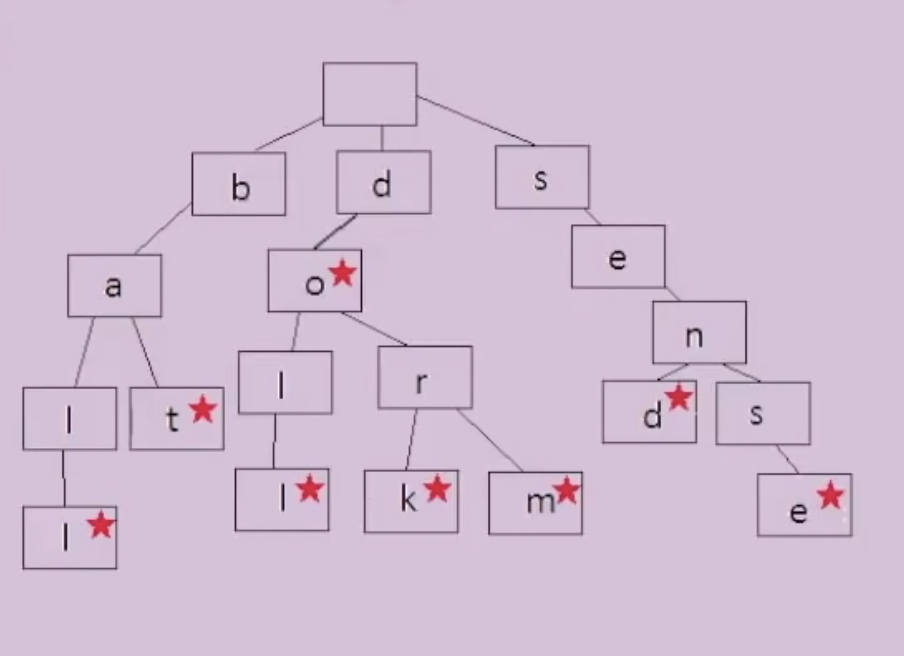

# Tries

Also called prefix tree is a special type of tree used to store associative data structures.
A trie stores data in steps.

Each step is a node in the Trie. This is often used to store words since there are a finit numbers of letters that can be put together to make a string.

Possible use case would be to validate a that a word is in a dictionary. Each step or node would represent one letter of a word.

Example:

Red star in node represents the end of a word.